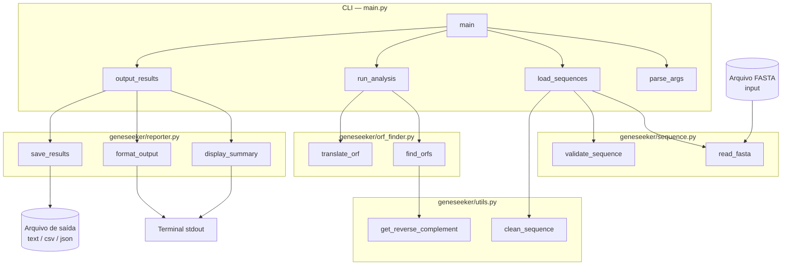
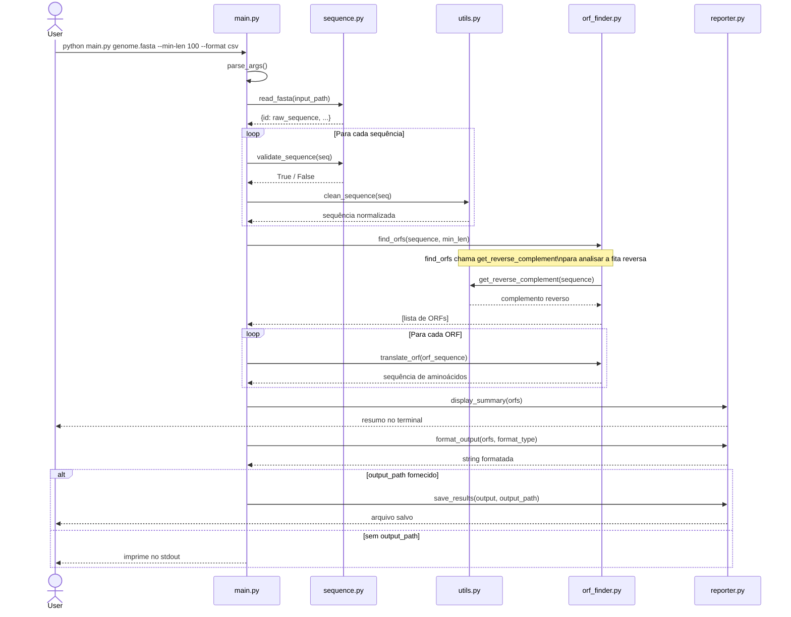
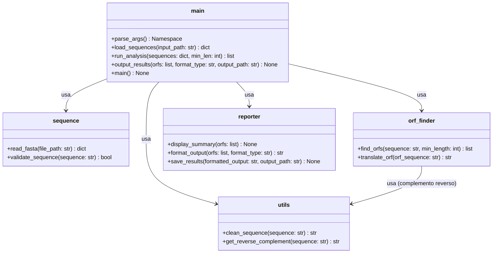
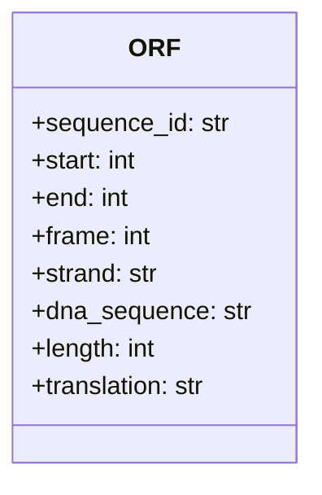
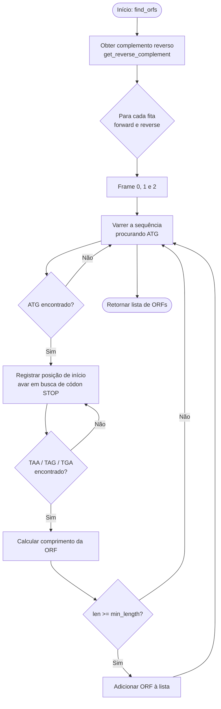
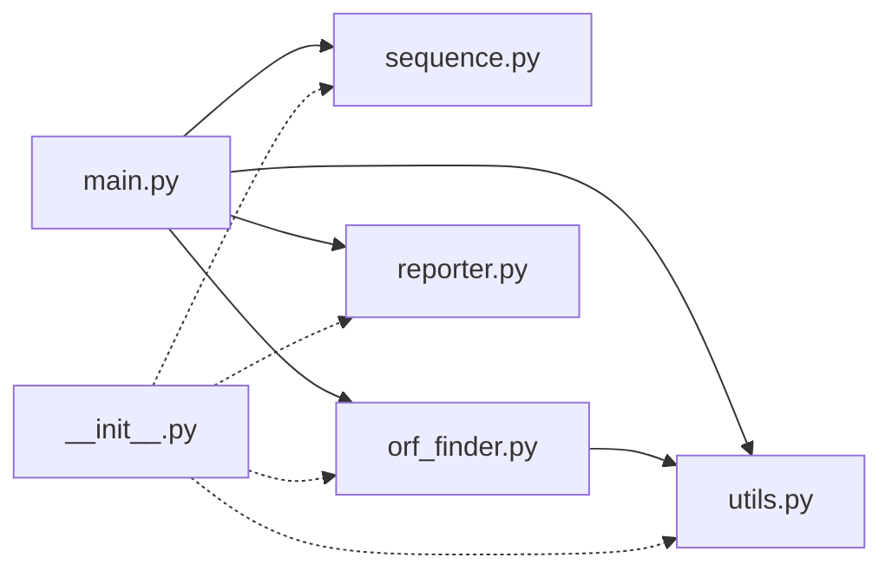
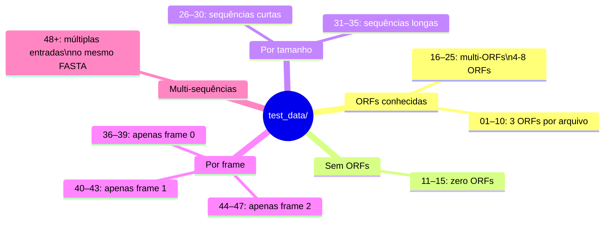

# GeneSeeker — Modelagem do Sistema

## 1. Diagrama de Componentes

## 2. Diagrama de Sequência — Pipeline Principal

## 3. Diagrama de Classes / Módulos

## 4. Estrutura de Dados — Objeto ORF

Cada ORF identificada por `find_orfs()` é representada como um dicionário:

| Campo | Tipo | Descrição |
|-------|------|-----------|
| `sequence_id` | `str` | Identificador da sequência FASTA de origem |
| `start` | `int` | Posição de início na sequência original (0-based) |
| `end` | `int` | Posição de fim (exclusive) na sequência original |
| `frame` | `int` | Quadro de leitura: `0`, `1` ou `2` |
| `strand` | `str` | Fita: `'+'` (direta) ou `'-'` (reversa) |
| `dna_sequence` | `str` | Sequência de DNA da ORF (ATG...STOP) |
| `length` | `int` | Comprimento em pares de bases |
| `translation` | `str` | Sequência de aminoácidos resultante |

## 5. Diagrama de Fluxo — `find_orfs()`

## 6. Mapa de Dependências de Arquivos

## 7. Visão Geral dos Dados de Teste

